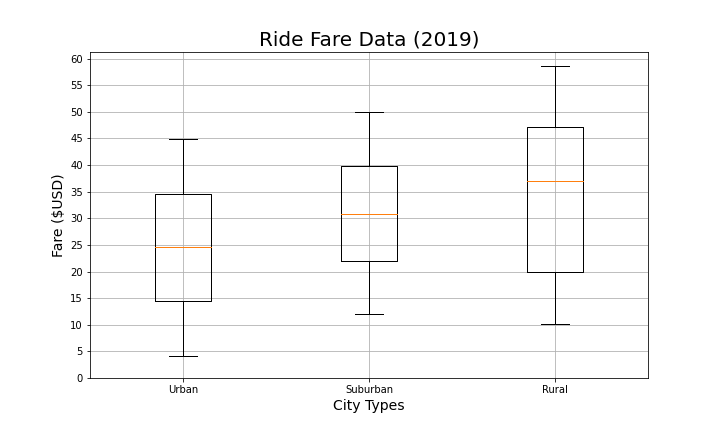
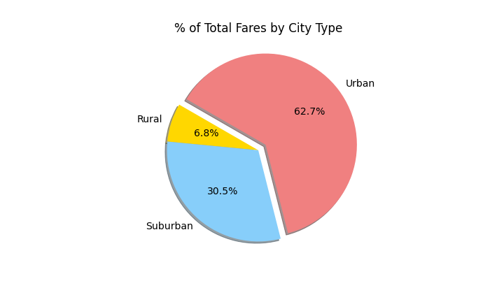

# PyBer Analysis Overview

The CEO of PyBer has asked me to analyze the company's ride-share data using pandas, numpy, and matplotlib libraries. They want me to provide insight on the differences between urban, suburban, and rural cities. The main areas being reviewed and analyzed is data regarding rides, drivers, and fares in these three city types.

# Results of Analysis

The following are areas of data analysis completes for this project represented in charts.

1. Overview of City Types
2. Rides for each City Type
3. Drivers for each City Type
4. Fares for each City Type

### Overview of City Types

This bubble chart shows the comparison of rides, drivers and fares for each city type.  The bubble size represents the drivers.

### Rides for Each City Type

These charts represent rides for each city type and total percentage of rides between the three city types.

 

### Drivers for Each City Type

These charts represent drivers for each city type and total percentage of drivers between the three city types.

 

### Fares for Each City Type

These charts represent the fares for each city type and the total percentage of fares between the three city types. The last chart shows weekly fare totals for each city type.

  

# Summary

Based on the results listed above, I have come up with three different recommendations to address the disparities among the city types.

1.  Rural city types make up 5.3% of rides, 6.8% of fares, but only have 2.6% of drivers. We should attract more drivers to service rural areas by showing that on       average they can make more per ride compared to the other city types.

2.  Suburban city types make up 26.3% of rides, 30.5% of fares, but only have 16.5% of drivers. We should attract more drivers by showing they have the most             consistent fares compared to the other city types.

3.  Urban city types have 68.4% of rides, 62.7% of fares, and the majority of drivers at 80.9%. We should attract more riders by showing that on average their fares     are the lowest of any city type.

